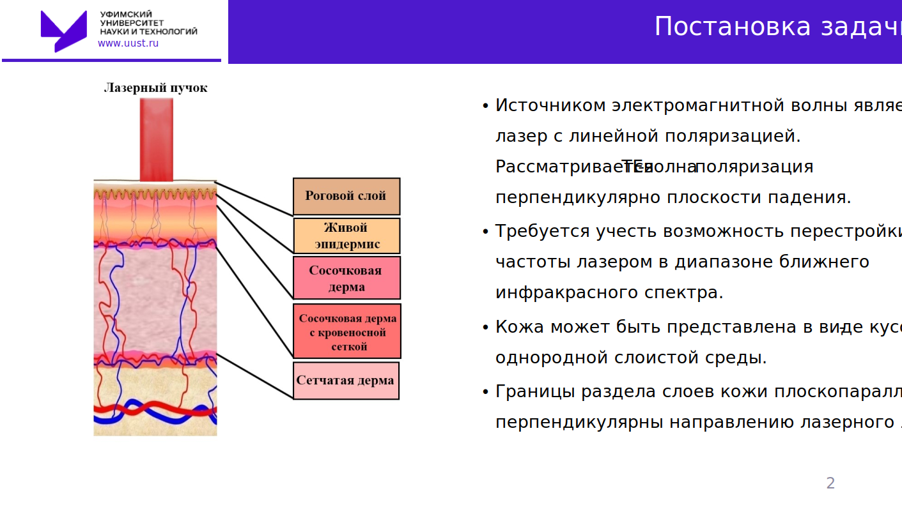
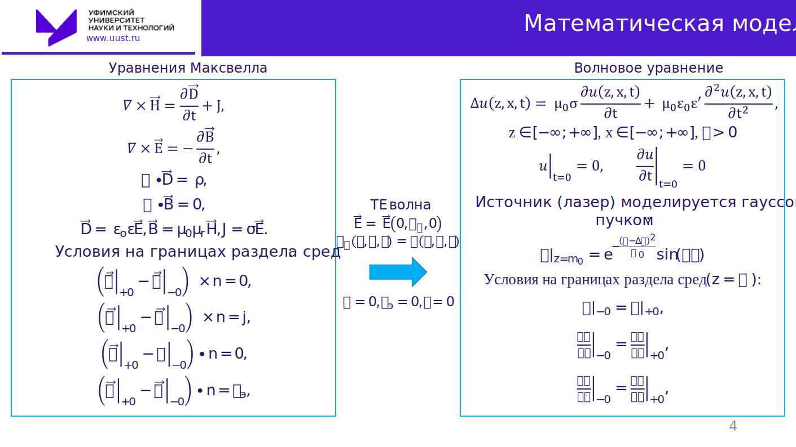
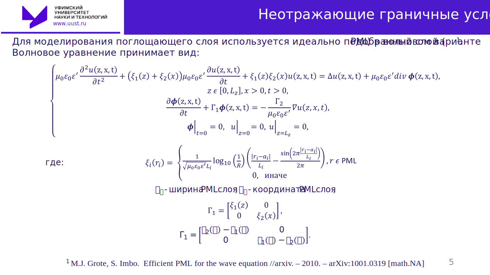
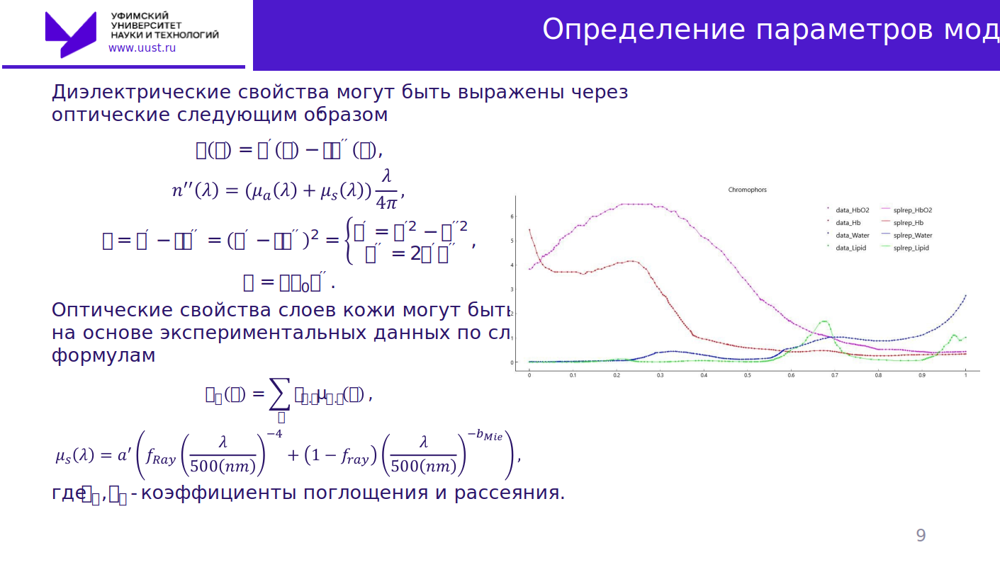
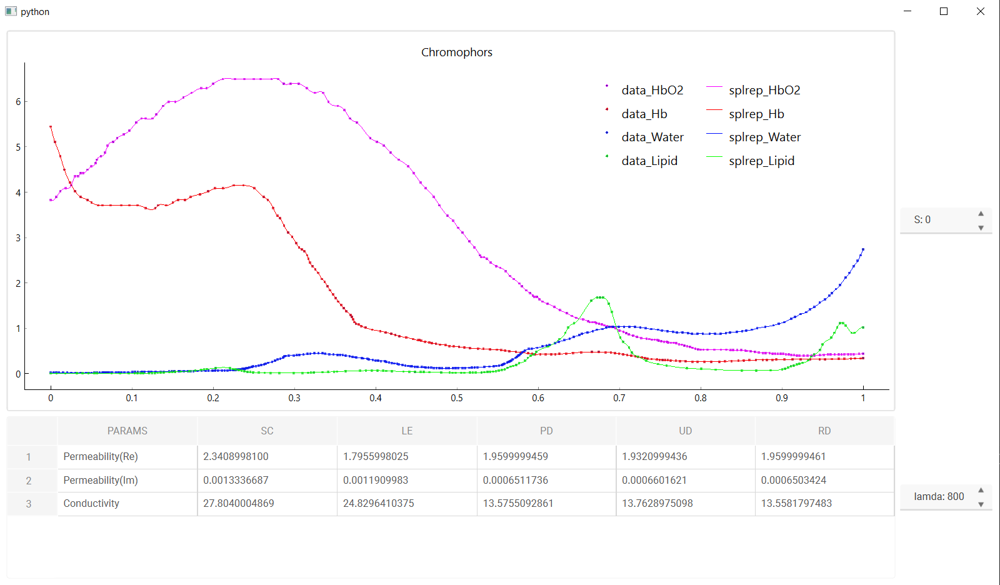
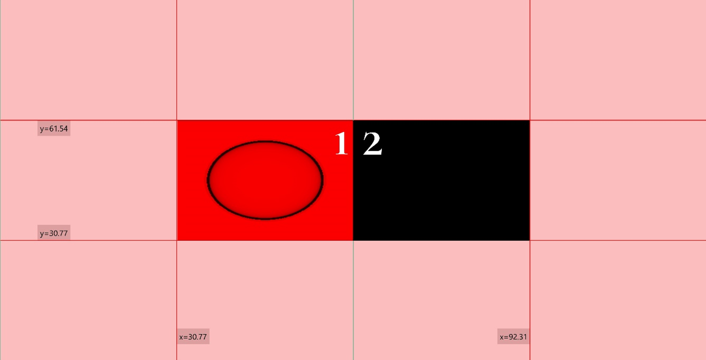
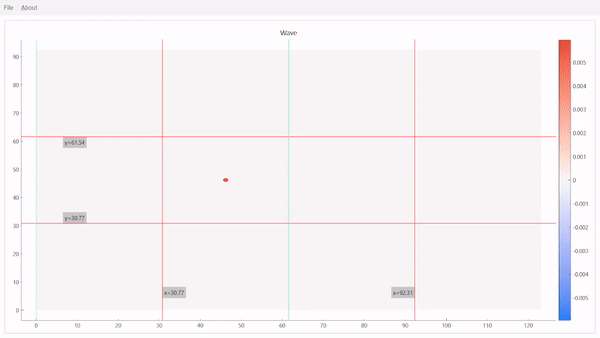
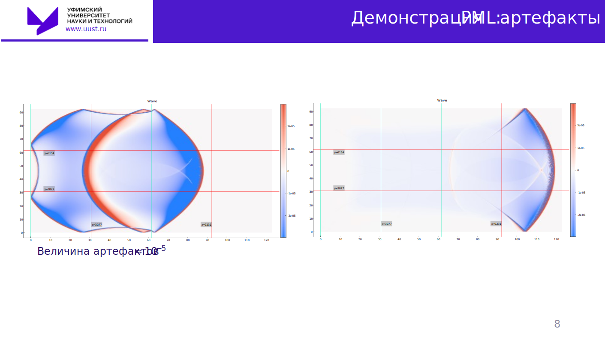
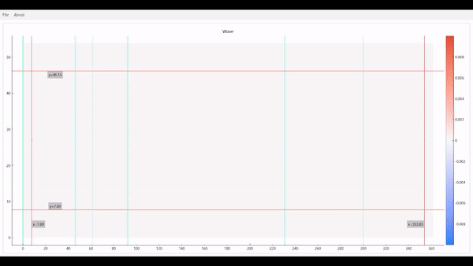
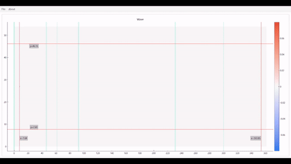

# Работа выполнена в рамках выпускной квалификационной работы в УГАТУ ОНФ (УУНИТ ФИРТ с 2022г.)

**Выпускная квалификационная работа бакалавра по направлению 01.03.04 «Прикладная математика»**

**«ЧИСЛЕННОЕ МОДЕЛИРОВАНИЕ РАСПРОСТРАНЕНИЯ СВЕТОВОГО ВОЛНОВОГО ПАКЕТА В БИОЛОГИЧЕСКОЙ ТКАНИ СЛОИСТОЙ СТРУКТУРЫ»**

**Автор ВКР: Валитов Данис Мансурович, гр. ПМ-453**
**Руководитель ВКР: Лукащук Станислав Юрьевич, д.ф.-м.н., доцент**
**Консультант ВКР: Ямилева Альфия Маратовна**

- [Работа выполнена в рамках выпускной квалификационной работы в УГАТУ ОНФ (УУНИТ ФИРТ с 2022г.)](#работа-выполнена-в-рамках-выпускной-квалификационной-работы-в-угату-онф-уунит-фирт-с-2022г)
    - [ВКР](#вкр)
    - [Краткий пересказ](#краткий-пересказ)
      - [Постановка задачи](#постановка-задачи)
      - [Математическая модель](#математическая-модель)
      - [Неотражающие граничные условия](#неотражающие-граничные-условия)
      - [Параметры кожи](#параметры-кожи)
      - [Запись и анимация](#запись-и-анимация)
      - [Параллельность](#параллельность)
    - [Демонстрация](#демонстрация)
      - [PML](#pml)
    - [1D](#1d)
    - [2D](#2d)
    - [Список литературы](#список-литературы)

### ВКР
- [(Тык) Посмотреть отчет](doc/VKR_MERGED.pdf)
- [(Тык) Посмотреть Презентацию](doc/VKR_MERGED.pdf)
### Краткий пересказ
#### Постановка задачи

#### Математическая модель
***Полная модель распространения света в исходной постановке может быть представлена в виде уравнений максвелла дополненных материальными уравнениями связи и граничными условиями на границе раздела сред. Т.к исследуем поведение поля за пределами той области, где находятся его источники, уравнения Максвелла можно свести к волновому уравнению. Из предположения о линейной поляризованности, условия на границе раздела сред перепишутся как равенство самой функции и его производных.***

#### Неотражающие граничные условия
***Моделирование распространения света выполняется в ограниченной области пространства. И с целью минимизации отражения от границ необходимо реализовать неотражающие граничные условия. В данной работе, неотражающим граничным условие является идеально подобранный слой в волновом варианте***

***Реализацию PML в однослойной среде можно посмотреть тут:***
TODO:

#### Параметры кожи
***Объектом исследования является биологическая ткань, а именно кожа. Ее неоднородность по отношению к электромагнитным свойствам проявляется в зависимости диэлектрической  проницаемости и удельной проводимости от пространственных координат.***

***Кожа была представлена как кусочно однородная многослойная среда, исходя из анатомической стрктуры и представлена в отчете в главе 1.2. Экспериментальные данные найдены из различных источников. Используемые значения приведены в отчете в приложении Б.*** 

***Исходные эксперментальные можно найти тут:***
- [Спектральные свойства хромофоров](Skin/README.md)
  
***Код для аппроксимации данных приведен:***
- [Тык](Wave/src/Cpython/appr.py)
  

S - параметр сглаживания. Lamda - исходная длина волны. Ось х отнормирована от 800-1400 нм 
#### Запись и анимация
***Запись в файл производится посредством использования библиотеки HDF5. Это ускорило программу примерно в два-три раза (конкретные замеры для сравнения не производились)***

***Отрисовка полученных данных выполняется с помощью pyqtgraph обернутой графическим интерфейсом в pyside6***

#### Параллельность 

***Поскольку мы заинтересованы в ближнем ИК диапазоне излучения, размер расчетной области значительно увеличивается, что в свою очередь приводит к увеличению времени расчета. Поэтому программа была распараллелена средставми OpenMP. Последовательная версия в 5 слоев кожи должна была занять ~10 дней расчета. Параллельная версия управилась за ~5 часов.***

### Демонстрация
#### PML
Для демонстрации PML слоя рассмотрим двухслойную среду, с разными показателями преломления. Источник задан в виде начального условия гауссова распределения:

Можно увидеть, что, волна на границе раздела сред отражается и преломляется. А когда волна проходит через слой PML, она постепенно затухает и практически не отражается назад. После прохождения волны через слой PML ее энергия полностью поглощается в этом слое и не распространяется дальше. Однако после дискретизации он больше не является идеально поглощающим, и поэтому невозможно полностью устранить отраженную волну, но можно показать артефакты, появляющиеся при использовании PML слоя в численном моделировании. Для этого ограничим диапазон цветовой шкалы от $−2∙10^{−5}$ до $2∙10^{−5}$.

На рисунке можно увидеть, как отраженная волна появляется при использовании PML слоя и при её преломлении внутри PML слоя. Несущая величина артефактов составляет примерно 10^(−5), что при решении поставленной задачи является допустимым

### 1D
TODO: Добавить демо
### 2D

**Импульсный источник**

Видно, что импульс на границах раздела сред преломляется и отражается, теряя часть своей энергии. Однако, начиная с 4 слоя отраженная волна становится мала, по сравнению с падающей волной и приблизительно равна порядку шума, вызванного погрешностью при генерации импульса. 
 

**Постоянный источник с переменной частотой**

Изменим импульс на постоянный источник в виде гауссова пучка с линейно изменяющейся со временем частотой волны. Наблюдается интерференционная картина, возникающая при наложении проходящих и отраженных волн разной частоты.
Задание источника с изменяющейся частотой дает возможность получения А-скана с помощью дискретного преобразования Фурье, примененного к волне, полученной умножением на волну, проходящую за то же время по воздуху. А-скан является результатом ОКТ с перестраиваемым источником и используется для определения глубины расположения определенных структур в ткани.

### Список литературы 
1.	Drexler.W Optical Coherence Tomography [Текст] : учебное пособие / W.Drexler,  J.G. Fujimoto. — Switzerland: Springer Reference, 2015. — 2567 с. 
2.	Fercher, A.F. Optical Coherence Tomography [Текст] / A.F. Fercher //Journal of Biomedical Optics. — 1996. — V.1. — P. 157–173.
3.	Семенов, Н.А. Техническая электродинамика [Текст] : учебное пособие / Н.А. Семенов. — Москва : Связь, 1973. — 480 с.  
4.	Пушкарева, А.Е. Методы математического моделирования в оптике биоткани [Текст] : учебное пособие / А.Е. Пушкарева. — Санкт Петербург : СПбГУ ИТМО, 2008. — 103 с.
5.	Мяделец, О.Д. Функциональная морфология и общая патология кожи [Текст] : учебное пособие / О.Д. Мяделец, В.П. Адаскевич. — Витебск: Витебский медицинский институт, 1997. — 269 с.
6.	Федюкович, Н.И. Анатомия и физиология человека [Текст] : учебное пособие / Н.И.  Федюкович. — Ростов н/Д: Феникс, 2003. — 416 с.
7.	Kallepalli, A. Quantification and influence of skin chromophores for remote detection of anemic condtions [Текст] / A. Kallepalli, D.B. James // Optical Interactions with Tissue and Cells. — 2020. — V.11238. — 13 p.
8.	Calabro, K. Modelling Biological Tissues in LightTools [Электронный ресурс] : technical paper / K. Calabro; Synopsys, Inc. – 2020. – Электрон. дан. – Режим доступа: https://www.synopsys.com/content/dam/synopsys/optical-solutions/documents/modeling-tissues-lighttools-paper.pdf. – Загл. с экрана.
9.	Anderson, R.R. Optical Properties of Human Skin [Текст] / R.R. Anderson, J.A. Parrish // Harvard Medical School — 1982. — P. 147-194.
10.	Troy, L. T. Optical properties of human skin in the near infrared wavelength range of 1000 to 2200 nm [Текст] / L.T. Troy, S.N. Thennadil // Journal of Biomedical Optics. — 2001. — V.6. — P. 167–176.
11.	Colas, V. Modeling and estimation of human skin optical properties using spatially resolved autofluorescence and diffuse reflectance spectroscopy [Текст] : thesis / V. Colas, University of Lorraine. — 2022. — 204 p.
12.	Bashkatov, A.N Optical properties of human skin, subcutaneous and mucous tissues in the wavelength range from 400 to 2000 nm [Текст] / A.N. Bashkatov, E.A. Genina, V.I. Kochubey, V.V. Tuchin // Journal of Physics. ¬ — 2005. — V.38. — P. 2543–2555.
13.	Anderson, R.R. The Optics of Human Skin [Текст] / R.R. Anderson, B.S. Parrish, J.A. Parrish // The Journal of Investigative Dermatalogy. ¬ — 1981. — V.77. — P. 13-19.
14.	Jacques, S.L. Optical properties of biological tissues: a review [Текст] / S.L. Jacques // Physics in Medicine and Biology. — 2013. — V.58. — P. 37 - 61.
15.	Lazareva, E.N. Blood refractive index modelling in the visible and near infrared spectral regions [Текст] / E.N. Lazareva, V.V. Tuchin // Journal of Biomedical Photonics. — 2018. — V.4., No 1, 010503. — 7 p.
16.	Handbook of optical biomedical diagnostics [Текст] : учебник / N.G. Khlebtsov [и др.] ; Под ред. V.V. Tuchin. — USA: SPIE, 2016. — 165 p.
17.	Bashkatov, A.N. Optical properties of skin, subcutaneous, and muscle tissue: A review [Текст] / A.N. Bashkatov, E.A. Genina, V.V. Tuchin // Journal of Innovative Optical Health Sciences. — 2011. — V.4. — P. 9 - 38.
18.	Berenger, J.P. A perfectly matched layers for the absorption of electromagnetic waves [Текст] / J.P. Berenger // Journal of Computational Physics. — 1994. — V.114. — P. 185 - 200.
19.	Abarbanel, S. Long time behavior of the perfectly matched layer equations in computational electromagnetics [Текст] / S. Abarbanel, D. Gottlieb, J.S. Hesthaven // Journal Sciense Computational. — 2002. — V.17. — P. 405 - 422.
20.	Appel, D. Perfectly matched layers for hyperbolic systems: general formulation, well-posedness, and stability [Текст] / D. Appel, T. Hagstrom, G.Kreiss // SIAM Journal on Applied Mathematics. — 2006. — V.67. — P. 1 - 23.
21.	Zhao, L. A general approach for the development of unsplit-field time-domain implementations of perfectly matched layers for FDTD grid truncation [Текст] / L. Zhao, A.C. Cangellaris // IEEE Microwave and Guided Letters. — 1996. — V.6. — P. 209-211.
22.	Diaz, J. A time domain analysis of PML models in acoustics [Текст] / J. Diaz, P. Joly // Computer Methods in Applied Mechanics and Engineering. — 2006. — V.195. — P. 3820 - 3853.
23.	Becache, E. Stability of Perfectly Matched Layers, Group Velocities and Anisotropic Waves [Текст] / E. Becache, S. Fauqueux // Journal of Computional Physics. — 2003. — V.188. — P. 399 - 433.
24.	Grote, M.J. Efficient PML for the wave equation [Электронный ресурс] / M.J. Grote, S. Imbo // arxiv / Cornell University. – 2010. – arXiv:1001.0319 [math.NA] – 16 p. – Электрон. дан. – Режим доступа: https://arxiv.org/abs/1001.0319. – Загл. с экрана
25.	 CrudBlurr/wave [Электронный ресурс] : Репозиторий проекта / Д.М. Валитов. — Электрон. дан. – 2023. — Режим доступа: https://gitlab.com/CrudBlurr/wave/-/tree/master?ref_type=heads. — Загл. с экрана.(дата обращения: 29.06.2023)
26.	Meglinski, I.V. Quantitative assessment of skin layers absorption and skin reflectance spectra simulation in the visible and near- infrared spectral regions [Teкст] / I.V. Meglinski, S.J. Matcher //Physiol Meas. — 2002. — V.23. — P. 741-753.
27.	Assorted Spectra [Электронный ресурс] / S. Jacques, S. Prahl. — Электрон. дан. — 2018. — Режим доступа: https://omlc.org/spectra/index.html. —  Загл. с экрана. — Англ.
28.	Effect of bile absorption coefficients on the estimation of liver tissue optical properties and related implications in discriminating healthy and tumorous samples [Текст] / R. Nachabe [и др.] // Biomedical Optics Express. — 2011. — V.2. — P. 600-614.
29.	Estimation of biological chromophores using diffuse optical spectroscopy: benefit of extending the UV-VIS wavelength range to include 1000 to 1600 nm [Текст] / R. Nachabe [и др.] // Biomedical Optics Express. — 2010. — V.1. — P. 1432-1442.
30.	Diffuse optical characterizations of collagen absorption from 500 to 1700 nm [Текст] / S.K. Sekar [и др.] // Biomedical Optics. — 2017. — V.22., N. 015006. — 6 p.
31.	Influence of blood pulsation on diagnostic volume in pulse oximetry and photoplethysmography measurements [Текст] / V. Dremin [и др.] // Applied Optics. — 2019. — V. 58. — P. 9398-9405.
